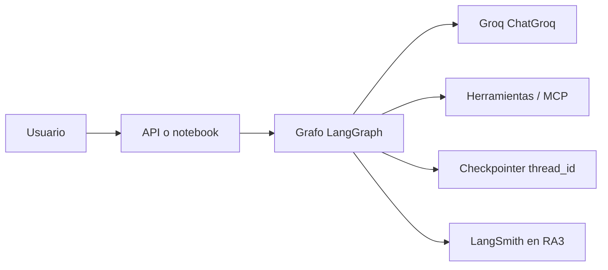

# Arquitectura del sistema de agentes (RA2)

Plantilla de entregable para **IL2.4**. Documenta *el* sistema que ya construiste
en IL2.1–IL2.3: no un agente genérico. Copia este archivo a tu repo de proyecto
y rellena las secciones en cursiva.

## 1. Decisión de runtime (ADR corto)

**Contexto:** hay que orquestar un LLM, herramientas, memoria y (si aplica) más de un rol.

**Decisión:** el camino actual del curso es **LangGraph**.

| Runtime | Cuándo | Dónde lo viste |
|---|---|---|
| `create_agent` + checkpointer | Un loop ReAct con tools y `thread_id` | IL2.1 `3-langgraph-agent.ipynb`, IL2.2 memoria |
| `StateGraph` a mano | Rutas, supervisor, HITL, tope de iteraciones | IL2.1 grafo wiki/charla, IL2.3 orquestación |
| Supervisor / `Command(goto=...)` / `Send` | Varios especialistas, handoff, fan-out | IL2.3 `4-langgraph-multiagente.ipynb` |
| CrewAI (`groq/` + roles) | Prompts de sistema incompatibles + proceso | IL2.1 `4-crewai-agent.ipynb` |
| Python puro (DAG, STRIPS, negociación) | El algoritmo, sin pagar tokens | IL2.3 scripts sin API |
| `AgentExecutor` | *Leer* código 2023-2025, no empezarlo | IL2.1 `3-langchain-agent.ipynb` (contraste) |

**Justificación de *este* proyecto:** *una frase: por qué no basta un agente, o por qué sí.*

**Alternativas rechazadas:** *CrewAI / clásico / más nodos — y el costo en tokens que mediste.*

## 2. Vista C4 (contexto)

Capas (el mismo corte que `1-architecture_example.py`, con LLM de verdad):

| Capa | En el script de IL2.4 | En el proyecto RA2 |
|---|---|---|
| Presentación | `mostrar_respuesta` | notebook, FastAPI, chat |
| Aplicación | `AgenteOrquestador` | `create_agent` o nodo supervisor |
| Dominio | `calculadora` / `buscador` | tools con contrato (`@tool`, MCP) |
| Infraestructura | `RegistroHerramientas` | Groq, checkpointer, vector store |

El orquestador de `1-architecture_example.py` **es un supervisor sin LLM**:
clasifica intención → elige herramienta → ejecuta. En IL2.3 el supervisor
hace lo mismo, pero la clasificación la escribe `ChatGroq`.

## 3. Contratos que hay que escribir

1. **Estado del grafo:** campos (`messages`, `ruta`, …) y quién los muta.
2. **Memoria:** `InMemorySaver` en clase; `thread_id` por conversación. ¿Qué
   ocurre si llega otro hilo? (IL2.2 ya lo demostró.)
3. **Herramientas:** nombre, args, qué *no* aceptan. MCP = el mismo contrato
   fuera del proceso (IL2.2 `3-herramientas-externas.ipynb`).
4. **Tope de iteraciones / reintentos:** Groq responde `400 tool_use_failed` y
   `429`. El patrón está en `2-best_practices.py`.
5. **Tokens por tarea completa:** un agente vs supervisor vs CrewAI. Si el
   equipo no gana en calidad, no se justifica (IL2.1 `5-criterio-frameworks.md`).

## 4. Checklist del entregable

- [ ] Diagrama del grafo (nodos y aristas; `mostrar_grafo` basta, no hace falta `grandalf`)
- [ ] ADR de runtime (tabla de arriba, rellenada)
- [ ] Lista de tools con ejemplos de entrada válida e inválida
- [ ] Cómo se identifica un hilo (`thread_id`) y cómo se olvida
- [ ] Medición: llamadas LLM, tokens, segundos, en *una* consulta representativa
- [ ] README de setup: `GROQ_API_KEY`, `GROQ_MODEL`, `uv sync`
- [ ] Qué observa RA3: la misma traza LangSmith de este grafo

## 5. Qué *no* documentar como si fuera el default

- `create_react_agent` de LangGraph (deprecado → `langchain.agents.create_agent`)
- `AgentExecutor` como arquitectura de proyecto nuevo
- Swarm de OpenAI como runtime vigente (el patrón handoff vive en LangGraph)
- Un “equipo de 5 agentes” sin medición de tokens
